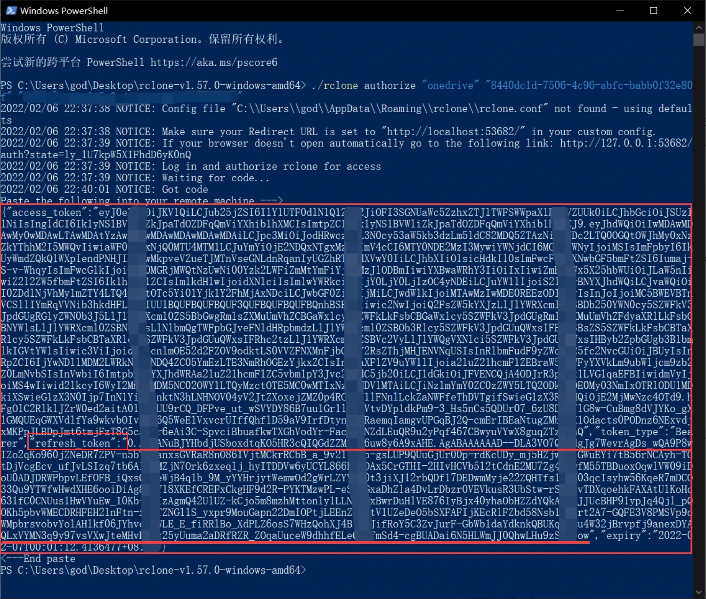

## 一个续订365 E5的脚本
### 此文仅为AutoApi配置笔记，不是续订教程，不保证百分百续订

> 所需工具:
> 
> e5管理员账户
> 
> [rclone](https://rclone.org/)
> 

### 注册管理员账户
直接进入[微软官网](https://www.microsoft.com/),点击页面底部office365开发人员计划


### Microsoft Azure注册应用
- 使用e5管理员账户登录进入[Microsoft Azure官网](https://portal.azure.com/)
- 点击Azure Active Directory下方的查看


- 注册新的应用


- 填入信息，完成后点击注册
```
名称随便填
受支持的账户类型选择任何组织目录
重定向URL选择web
地址填http://localhost:23812/
```

- 复制应用程序(客户端)ID到记事本


- 新建客户端密码


- 复制密码到记事本


- 点击左侧api权限


- 依次将下面12条权限添加
```
Calendars.ReadWrite
Contacts.ReadWrite
Directory.ReadWrite.All
Files.ReadWrite.All
MailboxSettings.ReadWrite
Mail.ReadWrite
Mail.Send
Notes.ReadWrite.All
People.Read.All
Sites.ReadWrite.All
Tasks.ReadWrite
User.ReadWrite.All
```


- 添加完成后，点击代表授予管理员同意


- 打开rclone解压出来的文件夹，在文件夹内打开powershell，输入以下指令，在弹出来的页面上登录自己的管理员账户
```
./rclone authorize "onedrive" "应用程序(客户端)ID" "客户端密码"
```

- 完成授权后，回到powershell界面，复制密钥到记事本`“refresh_token”:” 到 “,”expiry”之间的字符为微软密钥，不包括双引号`


### GitHub配置AutoApi

- Fork 本项目
- 打开Settings，Developer settings，Personal access tokens

- 新建GitHub密钥，名称为GH_TOKEN，勾选repo

- 复制GitHub密钥到记事本
- 回到项目，新建secret


- 分别创建六个secret

```
Name:CLIENT_ID
Value:[应用程序(客户端)ID]

Name:CLIENT_SECRET
Value:[客户端密码]

Name:MS_TOKEN
Value:[微软密钥]

Name:GH_TOKEN
Value:[GitHub密钥]

Name:CITY
Value:[城市,用于发送天气邮件，例如Beijing]

Name:EMAIL
Value:[用于接收邮件的邮箱]

```

### 测试

进入Action界面按提示开启，双击项目右上角star，如有进程，说明运行成功
